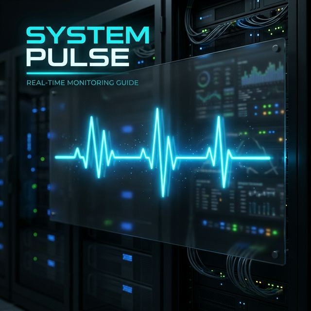
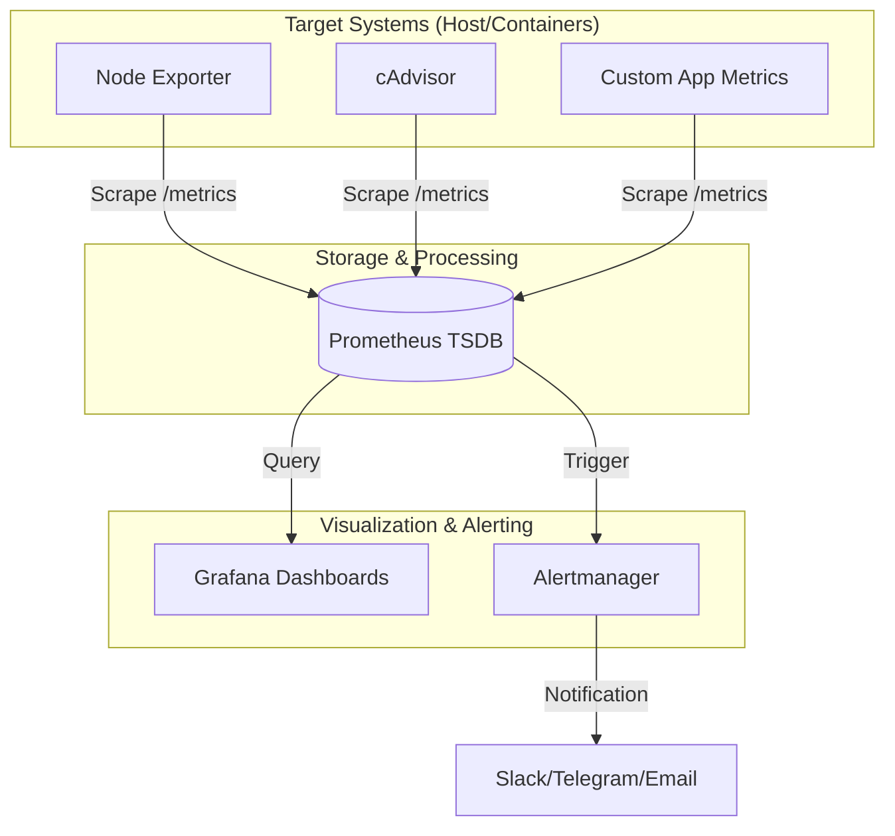

<p align="center">
  
</p>

# 📈 Sistem Nabzı Rehberi (System Pulse Guide)

> **"Ölçemediğin sistemi yönetemezsin."** – *Modern Sistem Gözlemlenebilirliği ve Performans Analizi Laboratuvarı.*

Modern bilişim ekosistemlerinde sistemlerin sadece "çalışıyor" (up) statüsünde olması, günümüzün karmaşık altyapı ihtiyaçlarını karşılamak için yeterli bir kriter değildir. Gerçek mühendislik disiplini ve profesyonellik; sistemlerin iç dinamiklerini derinlemesine anlamak, kaynak kullanım patternlerini analiz ederek olası darboğazları (bottleneck) çok önceden sezmek ve tüm altyapı kararlarını somut verilere dayalı olarak alabilmektir. **Sistem Nabzı Rehberi**, en temel donanım metriklerinden en karmaşık AIOps senaryolarına kadar uzanan, altyapı mimarlarından kıdemli DevOps mühendislerine kadar geniş bir yelpazeyi hedefleyen, akademik titizlikle hazırlanmış bir uygulama ve teori rehberidir.

---

## 🏛️ Müfredat ve Yol Haritası (Curriculum)

Bu depo, rastgele dökümantasyonların aksine, sistem mühendisliği nosyonunu sıfırdan inşa eden ve 6 ana fazdan oluşan, yapılandırılmış ve hiyerarşik bir öğrenme yolculuğu sunar:

### 🟢 Faz 01: Temeller ve Metrik Okuryazarlığı
Sistem gözlemlenebilirliğinin temel yapı taşı, ham veriyi anlamlı bir bilgiye dönüştürebilmektir. Bu aşamada, sistem metriklerinin anatomisini (Counters, Gauges, Histograms/Summaries) derinlemesine inceliyoruz. Sektör standardı haline gelmiş **USE Metodu** ile altyapı kaynaklarının (Utilization, Saturation, Errors) nasıl izleneceğini ve uygulama katmanında **RED Metodu** (Rate, Errors, Duration) ile servis sağlığının nasıl ölçüleceğini, pratik vaka analizleri eşliğinde öğreniyoruz.
- [Ayrıntılı Müfredatı Keşfet →](./Phase-01-Temeller/)

### 🔵 Faz 02: Linux Derin Dalış (Observability)
Linux çekirdeğinin (kernel) sunduğu gözlemlenebilirlik araçlarını en alt seviyeden başlayarak ele alıyoruz. `procfs` ve `sysfs` gibi sanal dosya sistemlerinin çalışma mantığından, modern sistemlerin vazgeçilmezi olan eBPF teknolojisi ile çekirdek seviyesinde (kernel-space) performans izlemeye kadar geniş bir yola çıkıyoruz. Geleneksel `sar`, `iostat`, `vmstat` komutlarından, modern ve optimize edilmiş yeni nesil gözlem araçlarına geçiş yaparak sistemin "kara kutu" olmaktan çıkmasını sağlıyoruz.
- [Ayrıntılı Müfredatı Keşfet →](./Phase-02-Linux-Gozlem/)

### 🟡 Faz 03: Windows Internals & Performance
Kurumsal altyapıların vazgeçilmezi olan Windows ekosisteminde, performans analizini sıradan bir Dashboard takibinden öteye taşıyoruz. Windows Performance Counters (PerfMon) mimarisinin hiyerarşik yapısını, Event Tracing for Windows (ETW) ile olay bazlı derinlemesine analizi ve WMI katmanının sunduğu zengin verileri nasıl otomatize edebileceğimizi inceliyoruz. PowerShell ve modern monitoring ajanlarının Windows internals ile nasıl entegre olduğunu deneyimliyoruz.
- [Ayrıntılı Müfredatı Keşfet →](./Phase-03-Windows-Internals/)

### 🟣 Faz 04: Modern Gözlemlenebilirlik Altyapısı
Teorik bilgiyi endüstriyel standarttaki araçlarla buluşturuyoruz. Zaman serisi veritabanı (TSDB) prensipleriyle çalışan **Prometheus**'un çekme (pull) mimarisini, veriyi estetik ve fonksiyonel bir sanata dönüştüren **Grafana** görselleştirme ekosistemini ve sistemlerin ham metriklerini Prometheus formatına çeviren **Node Exporter** gibi ajanların kurulum ve optimizasyon süreçlerini uçtan uca uyguluyoruz. Bu aşama, kendi profesyonel izleme merkezinizi kurabilmeniz için gereken tüm teknik detayları içerir.
- [Ayrıntılı Müfredatı Keşfet →](./Phase-04-Modern-Observability/)

### 🟠 Faz 05: Distributed Tracing & Logging
Mikroservis mimarilerinin yaygınlaşmasıyla birlikte, tekil metrikler sistemin bütününü anlatmakta yetersiz kalmaya başlamıştır. Bu fazda, OpenTelemetry (OTel) standartlarını kullanarak servisler arası istek yolculuğunu (Distributed Tracing) izlemeyi, Jaeger ve Tempo gibi araçlarla gecikme (latency) analizlerini yapmayı öğreniyoruz. Ayrıca, yapılandırılmamış log verilerini Loki veya Elastic ekosistemiyle merkezi bir noktada toplayıp, metriklerle loglar arasında korelasyon kurarak hata analizi (root cause analysis) hızımızı artırıyoruz.
- [Ayrıntılı Müfredatı Keşfet →](./Phase-05-Distributed-Tracing/)

### 🔴 Faz 06: AIOps ve Tahminleme (Elite)
Rehberin en ileri aşamasında, manuel müdahalenin ötesine geçerek yapay zeka ve sistem yönetimini birleştiriyoruz. Toplanan devasa metrik verilerinden makine öğrenmesi algoritmalarıyla anomali tespiti (anomaly detection) yapmayı, kapasite planlaması için predictive monitoring (geleceği öngören izleme) tekniklerini ve kritik durumlarda kendi kendine iyileşebilen (self-healing/autonomic computing) sistem tasarımlarını ele alıyoruz. Bu aşama, sistem yöneticiliğinden sistem mimarlığına geçişteki en üst teknik seviyeyi temsil eder.
- [Ayrıntılı Müfredatı Keşfet →](./Phase-06-AIOps-Automation/)

---

## 🛠️ Hızlı Başlangıç (Quick Start)

Bu profesyonel laboratuvar ortamını, herhangi bir karmaşık kurulum süreciyle vakit kaybetmeden kendi yerel makinenizde veya bulut sunucunuzda saniyeler içinde ayağa kaldırabilirsiniz. Docker ve Docker Compose teknolojisi sayesinde, tüm bağımlılıklar izole edilmiş ve önceden konfigüre edilmiş olarak gelir:

1. Depoyu klonlayın ve ilgili dizine gidin.
2. Servisleri Docker Compose ile arka planda başlatın:

```bash
cd scripts/docker-lab
docker-compose up -d
```

3. Kurulan servislere web tarayıcınız üzerinden erişim sağlayın:
   *   **Grafana Dashboard:** `http://localhost:3000` (Varsayılan: admin / admin) - Veri görselleştirme merkezi.
   *   **Prometheus UI:** `http://localhost:9090` - Metrik sorgulama ve TSDB arayüzü.
   *   **Node Exporter:** `http://localhost:9100/metrics` - Ham sistem metrik yayını.

---

---

## 🧩 Teknik Mimari (Technical Architecture)

Sistem Nabzı laboratuvarı, verinin toplanmasından görselleştirilmesine kadar olan süreci standart bir pipeline üzerinden yönetir. Aşağıdaki diyagram, laboratuvar ortamındaki bileşenlerin birbirleriyle nasıl etkileşime girdiğini göstermektedir:



---

## 🎯 Neden Sistem İzleme? (Deep Dive)

Sistem izleme (monitoring), sadece bir ekranın "yeşil" olduğunu doğrulamak değildir. Modern altyapılarda izleme, şu üç kritik sütun üzerine inşa edilir:

1.  **Gözlemlenebilirlik (Observability):** Sistemin dış çıktılarından (metrikler, loglar, trace'ler) iç durumunu ne kadar iyi anlayabildiğimizin ölçüsüdür. "Neden hata alıyoruz?" sorusunun cevabıdır.
2.  **Güvenilirlik (Reliability):** Sistemin beklenen işlevleri, belirlenen süre ve koşullarda yerine getirebilme kapasitesidir.
3.  **Hızlı Müdahale (MTTR):** Ortalama düzeltme sürenizi (Mean Time to Repair) minimize etmek, iş sürekliliği için hayati önem taşır. Veriye dayalı alarm mekanizmaları, sorunun kök nedenine saniyeler içinde inmenizi sağlar.

---

## 📡 Gelişmiş Senaryolar & Use Cases

Rehberimizdeki araçlar ve metodolojiler, şu gerçek dünya senaryolarında doğrudan uygulanabilir:

*   **Database Performance:** PostgreSQL veya MySQL üzerinde yavaş sorguların (slow queries) ve bağlantı havuzu (connection pool) doygunluğunun izlenmesi.
*   **Kubernetes Cluster Health:** Pod'ların kaynak kullanımı, OOM (Out Of Memory) hataları ve node bazlı darboğazların tespiti.
*   **Application APM:** Bir web uygulamasının uçtan uca yanıt süresinin (latency) ve hata oranlarının (error rate) takibi.

---

## ❓ Sıkça Sorulan Sorular (SSS)

**1. Prometheus neden "push" yerine "pull" yöntemini kullanıyor?**
Pull yöntemi, hedef sistemlerin (target) izleme sistemini meşgul etmesini önler ve bir hedefin çevrimdışı olup olmadığını (down state) saptamayı kolaylaştırır. Ayrıca merkezi bir konfigürasyon yönetimi sağlar.

**2. USE ve RED metodolojileri arasındaki fark nedir?**
USE metodu **altyapı kaynaklarına** (CPU, Disk vb.) odaklanırken; RED metodu **servislere ve isteklere** (HTTP requests, API calls) odaklanır. Tam bir gözlemlenebilirlik için ikisinin de kullanılması önerilir.

**3. cAdvisor ne işe yarar?**
Docker container'larınızın CPU, RAM ve I/O kaynaklarını izlemek için en etkili araçtır. Özellikle container'ların kaynak sınırlarına (limits) ne kadar yaklaştığını görmek için kritiktir.

---

## 👨‍🏫 Yazar ve Vizyon

Bu proje, **Bahattin Yunus Çetin (IT Architect)** tarafından, Türkiye'deki bilişim ekosisteminde sistem mühendisliği ve altyapı yönetimi disiplinlerinin teknik derinliğini ve vizyonunu küresel standartlara taşımak amacıyla hayata geçirilmiştir. Burada paylaşılan dokümantasyonlar ve uygulama kodları, sadece tutorial tadında değil; büyük ölçekli kurumsal altyapılarda uygulanmış tecrübelerin, endüstriyel best-practice'lerin ve yüksek erişilebilirlik (HA) mimarilerinin bir damıtılmış sonucudur. Amacımız, sadece araçları kullanmayı değil, sistemlerin "haldinden anlayan" mühendisler yetişmesine katkı sağlamaktır.

---

## 🤝 Katkıda Bulunma ve Topluluk

Modern ve sürdürülebilir bir sistem mimarisi, kolektif zeka ve topluluk desteğiyle her geçen gün daha da güçlenir. Eğer bu rehberde bir hata tespit ettiyseniz, yeni bir monitoring exporter'ı için konfigürasyonunuz varsa veya daha optimize edilmiş bir Grafana dashboard'u tasarladıysanız; [CONTRIBUTING.md](./CONTRIBUTING.md) dosyamızdaki ilkeleri takip ederek bu açık kaynaklı inisiyatife güç katabilirsiniz. Her türlü teknik katkı, bu "sistem nabzının" daha güçlü atmasını sağlayacaktır.

---
<p align="center">
  <i>"Sistemlerinizi karanlıkta bırakmayın, nabzını tutun. Veri, en büyük rehberinizdir."</i>
</p>
